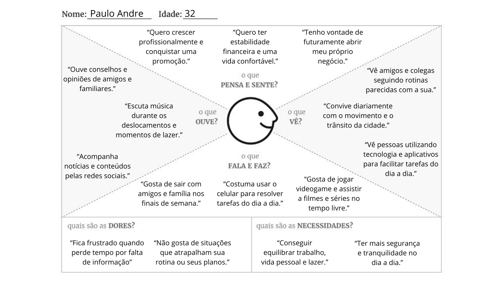

# Entrega 3 — Personas, mapa de empatia, contexto de uso e jornada

**Data:** {{02/09/2026}}  
**Status:** 🟨 em andamento  
**Responsabilidade:** 1 persona por integrante; 1 mapa de empatia, 1 contexto de uso consolidado e 1 jornada por equipe (salvo orientação diferente do docente).

## Objetivo da atividade

Representar grupos de usuários de forma útil para decisões de design. Persona não é personagem decorativo: suas características devem alterar requisitos, prioridades, linguagem, fluxos ou critérios de avaliação.

## Atenção a projetos técnicos

Em TCCs sem interface original, a persona pode representar um **profissional que se apropria da contribuição técnica**: DBA, analista, cientista de dados, administrador, pesquisador, técnico, operador, gestor ou especialista de domínio.

Não escolha um perfil apenas porque “parece combinar” com a tecnologia. Explique **qual objetivo esse perfil teria e qual parte da contribuição do TCC produziria valor para ele**. Se ainda for hipótese, mantenha como hipótese/proto-persona a validar.

Também considere papéis diferentes quando houver tarefas distintas, por exemplo:

- operador que executa análises;
- administrador que configura e gerencia permissões;
- especialista que interpreta resultados;
- gestor que consulta relatórios e decide;
- auditor que revisa histórico.

## Entradas da Entrega 1

Antes de criar personas, retome os tipos de usuários, características relevantes, objetivos e hipóteses registradas na Entrega 1. A persona **não deve transformar uma hipótese inicial em fato por meio de uma história fictícia**.

| Item da Entrega 1 | Status inicial | Evidência disponível agora | Como será tratado nesta entrega |
|---|---|---|---|
| 2.1 - Usuário final interessado em consultar o risco de alagamentos e inundações | H | Definido na Entrega 1 como público potencial da interface, mas ainda sem validação om usuário reais | Manter como hipótese e representar como persona e validar |
| 2.1/2.2 - Profissionais ou agentes envolvidos com monitoramento e prevenção | H | Identificados como possíveis usuários da contribuição, incluindo agentes da Defesa Civil | Manter como hipótese e considerar na criação das personas |
| 2.4 - Diferentes níveis de conhecimento técnico podem influenciar a interação | H | Hipótese de que os usuários comuns precisam de informações mais simples, enquanto profissionais podem demandar maior detalhamento | Incorporar nas personas e investigar |
| 3.1 - Obter informações antecipadas sobre o risco de alagamento de determinada região | H | Definido como objetivo principal do usuário na Entrega 1 | Incorporar como objetivo central das personas e manter como hipótese |
| 3.2/A01 - Consultar o risco de alagamento em determinada região | H | Identificada como possível atividade mais frequente | Incorporar à jornada e investigar |
| 3.2/A02 - Planejar deslocamentos ou ações preventivas com base no risco | H | Identificada como atividade de alta criticidade para o usuário final | Incorporar à jornada e manter como hipótese |
| 5.1/5.3 - Uso principalmente durante períodos de chuva ou antes de deslocamentos, possivelmente sob pressão de tempo | H | Contexto de uso proposto na Entrega 1, ainda sem validação com usuários | Incorporar ao contexto de uso e investigar |
| 5.2 - Uso por computador ou dispositivo móvel | H | Dispositivos considerados plausíveis na Entrega 1 | Manter como hipótese e considerar no contexto de uso |
| H01 - Usuários compreendem melhor risco com níveis + porcentagem | H | Hipótese registrada na Entrega 1; ainda sem evidência com usuários | Manter como hipótese e investigar |
| H02 - Mapa é a melhor forma de consultar risco por região | H | Hipótese registrada na Entrega 1; mapas também aparecem em soluções semelhantes | Manter como hipótese e investigar |
| H03 - Alertas de risco são úteis para decisões preventivas | H | Hipótese registrada na Entrega 1 | Manter como hipótese e investigar |
| H04 - Usuários não técnicos podem ter dificuldade com probabilidades e dados isolados | H | Hipótese registrada na Entrega 1 | Incorporar à proto-persona e investigar |
| H05 - Informações adicionais sobre chuva e região aumentam a confiança na previsão | H | Hipótese registrada na Entrega 1 | Manter como hipótese e investigar |

## 1. Personas

### Persona P01 — Paulo Andre Oliveira

**Autor(a):** Eric Song Watanabe - 22.125.086-3
**Tipo:** primária
**Base de evidências:** proto-persona a validar 
**Hipóteses da Entrega 1 relacionadas:** H01, H02, H03 e H04

| Campo | Descrição |
|---|---|
| Faixa etária / contexto relevante | Adulto em idade ativa, com rotina de deslocamentos frequentes pela cidade de São Paulo. [H] |
| Ocupação/papel | Funcionário de escritório que trabalha presencialmente e precisa se deslocar entre casa e trabalho. [H] |
| Conhecimento do domínio | Baixo conhecimento técnico sobre hidrologia, precipitação e modelos de risco; entende conceitos cotidianos como chuva forte, alagamento e região de risco. [H] |
| Experiência tecnológica | Familiaridade intermediária com smartphones, mapas, aplicativos de navegação e previsão do tempo. [H] |
| Objetivos | Saber rapidamente se uma região apresenta risco de alagamento e usar essa informação para planejar deslocamentos com maior segurança. [H] |
| Necessidades | Informação clara, rápida e visual sobre localização, nível de risco, chuva e possíveis alertas, sem depender de conhecimento técnico avançado. [H] |
| Dores/frustrações | Ter que consultar diferentes fontes para entender a situação; dificuldade para interpretar porcentagens ou dados técnicos isolados; receber informação tarde demais. [H] |
| Motivadores | Evitar regiões potencialmente perigosas, reduzir imprevistos no trajeto e proteger sua segurança e seus bens. [H] |
| Restrições/acessibilidade | Pode consultar a interface sob pressão de tempo, em movimento e pelo celular; precisa de boa legibilidade, linguagem simples e informação que não dependa somente de cores. [H] |
| Ambiente típico de uso | Durante o trabalho, antes de sair de casa ou do escritório, ou durante um deslocamento em períodos de chuva intensa. [H] |
| Comportamentos relevantes | Costuma verificar mapas, trânsito ou previsão do tempo antes de determinados deslocamentos e tende a buscar informações rápidas antes de decidir uma rota. [H] |

**Decisões de design influenciadas por P01:**

- Priorizar uma apresentação simples e visual do risco, utilizando linguagem acessível, níveis de risco facilmente identificáveis e informações geográficas claras, permitindo uma consulta rápida mesmo em dispositivos móveis e evitando depender de conhecimentos técnicos sobre hidrologia.

> Repita para P02, P03... Cada integrante deve produzir ao menos uma persona.

### Síntese das personas

Explique diferenças entre os perfis e qual persona é prioritária. Evite personas duplicadas que só mudam nome/foto.

## 2. Mapa de empatia — equipe

**Persona escolhida:** {{P01}}  
**Justificativa:** {{por que esse perfil é relevante}}

Documente também em texto: o que vê; ouve; diz/faz; pensa/sente; dores; ganhos. Diferencie **evidência** de **hipótese**.

## 3. Contexto de uso — consolidação

| Dimensão | Descrição | Implicação de design |
|---|---|---|
| Usuários | {{...}} | {{...}} |
| Tarefas | {{...}} | {{...}} |
| Equipamentos | {{...}} | {{...}} |
| Ambiente físico | {{...}} | {{...}} |
| Ambiente social/organizacional | {{...}} | {{...}} |
| Papéis/permissões/governança | {{...}} | {{...}} |
| Volume de dados/histórico | {{...}} | {{...}} |

## 4. Jornada do usuário — equipe

**Persona:** {{P01}}  
**Objetivo da jornada:** {{...}}  
**Início e fim da jornada:** {{...}}

| Etapa | Situação/ação | Objetivo | Pensamento/emoção | Dor | Oportunidade de design | Evidência |
|---|---|---|---|---|---|---|
| 1 | {{...}} | {{...}} | {{...}} | {{...}} | {{...}} | {{...}} |

> A jornada pode incluir etapas **antes, durante e depois** do uso do produto. Não transforme a jornada em lista de telas.

## Síntese

Quais necessidades e objetivos devem obrigatoriamente aparecer nos cenários e nas tarefas seguintes?

## Checklist

- [ ] Existe pelo menos uma persona por integrante.
- [ ] As personas não são apenas diferenças demográficas superficiais.
- [ ] Está claro o que é dado real e o que é hipótese/proto-persona.
- [ ] A persona não “validou por ficção” uma hipótese da Entrega 1; afirmações continuam marcadas como hipótese quando não há evidência.
- [ ] Objetivos e dores têm consequência para o design.
- [ ] Contexto de uso está coerente com a Entrega 1.
- [ ] Em TCC sem interface original, a persona possui relação explícita com a contribuição técnica.
- [ ] Papéis administrativos, técnicos e decisórios só foram criados quando possuem objetivos/tarefas diferentes.
- [ ] Jornada possui etapas, dores e oportunidades e não é apenas wireflow.
- [ ] IDs das personas foram adicionados à rastreabilidade.
