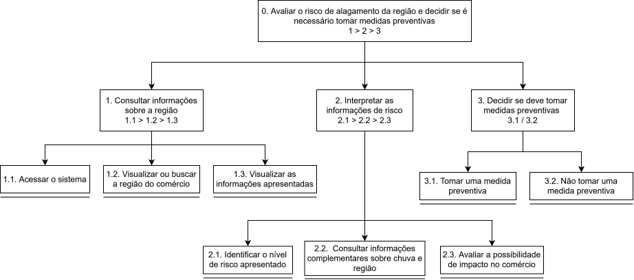

# Entrega 5 — Análise de tarefas: HTA, GOMS e CTT

**Data:** {{08/10/2026}}  
**Status:** 🟨 em andamento  
**Responsabilidade:** cada integrante modela pelo menos 1 HTA, 1 GOMS e 1 CTT. As três técnicas podem abordar a mesma funcionalidade ou funcionalidades distintas, conforme a orientação da disciplina.

## Objetivo da atividade

Modelar tarefas importantes sob perspectivas complementares: decomposição hierárquica (HTA), estrutura de metas/métodos/operações (GOMS) e relações temporais entre tarefas (CTT). O diagrama deve ser acompanhado de interpretação textual.

## Para projetos cujo TCC não previa interface

Modele **tarefas humanas relacionadas ao uso da contribuição técnica**, e não a implementação interna do algoritmo. Exemplos de boas tarefas para análise:

- investigar uma consulta de baixo desempenho;
- configurar uma análise e selecionar parâmetros;
- submeter um dataset e verificar sua validade;
- acompanhar uma execução demorada;
- comparar dois resultados/modelos;
- interpretar uma recomendação e decidir se a aceita;
- localizar uma execução anterior usando busca/filtros;
- gerar e compartilhar um relatório;
- administrar papéis/permissões quando isso for parte do trabalho real;
- revisar um alerta e registrar uma decisão.

Um CRUD pode gerar tarefas relevantes, mas “cadastrar usuário” só merece modelagem se tiver significado no domínio (papéis, validações, riscos, permissões, dependências).

## Seleção das tarefas

| ID | Tarefa | Persona/cenário de origem | Frequência/criticidade | Autor responsável |
|---|---|---|---|---|
| T01 | Consultar e interpretar o risco de alagamento na região do comércio para decidir se são necessárias medidas preventivas | P03 / C02 | Frequência:  Criticidade: alta, pois a informação pode apoiar decisões preventivas e evitar possíveis prejuízos ao comércio. | Rafael Iamashita Becsei — 22.225.037-5 |
| T02 | {{...}} | {{P01/C01}} | {{...}} | {{...}} |

> Priorize tarefas necessárias para que o usuário alcance objetivos centrais. Não desperdice a modelagem em ações triviais isoladas, como “clicar em login”, se o objetivo relevante é maior. Da mesma forma, não modele o funcionamento interno do algoritmo como se fosse uma tarefa humana.

---

## HTA — T01 {{nome da tarefa}}

**Autor(a):** {{nome — matrícula}}

### Descrição da tarefa

{{objetivo, ponto de início, conclusão esperada, contexto}}

### Diagrama

### Decomposição e planos

| ID | Objetivo/operação | Plano/ordem | Problema ou decisão de design observada |
|---|---|---|---|
| 0 | {{objetivo principal}} | {{1 }} 2 > 3 / 1 ou 2 etc.> | {{...}} |

**Verificação do HTA:**

- O objetivo 0 representa uma meta do usuário?
- As subtarefas são necessárias e suficientes?
- Os **planos** indicam ordem, alternativa, repetição ou condição?
- A decomposição parou em nível útil para projeto de interação?

---

## GOMS — T01 {{nome da tarefa}}

**Autor(a):** {{nome — matrícula}}

### Goal

`G0: {{meta do usuário}}`

### Métodos, operadores e regras de seleção

- **Method M1:** {{...}}
  - Operators: {{perceber, apontar, clicar, digitar, decidir... conforme o nível adotado}}
- **Method M2:** {{...}}
  - Operators: {{...}}
- **Selection Rule SR1:** usar M1 quando {{condição}}; usar M2 quando {{condição}}.

> Não chame qualquer passo de “método”. Em GOMS, métodos são sequências alternativas capazes de atingir uma meta; regras de seleção explicam quando escolher entre eles.

---

## CTT — T01 {{nome da tarefa}}

**Autor(a):** {{nome — matrícula}}

### Descrição

{{...}}

### Diagrama

### Legenda e relações temporais usadas

| Operador/relação | Significado no diagrama | Exemplo no modelo |
|---|---|---|
| {{...}} | {{...}} | {{...}} |

Identifique, quando aplicável, tarefas de usuário, sistema, interação e tarefas abstratas. Verifique se concorrência, escolha, habilitação, desabilitação e repetição estão representadas corretamente segundo a notação adotada em aula.

---

## HTA — T02 Consultar o risco de alagamento da região e decidir sobre medidas preventivas

**Autor(a):** Victor Pimentel Lario — 22.125.064-0

### Descrição da tarefa

Victor Merker Binda está em casa acompanhando notícias sobre a previsão de chuva intensa. Preocupado com a possibilidade de alagamentos próximos à sua residência, decide consultar as informações de risco da região pelo celular. Seu objetivo é compreender o nível de risco apresentado e avaliar se precisa tomar alguma medida preventiva para proteger sua casa e seus bens.

A tarefa começa quando Victor decide buscar informações sobre sua região e termina quando consegue interpretar a situação e decidir como deve agir. Caso a chuva continue, ele pode voltar a acompanhar as informações para verificar possíveis mudanças.

### Diagrama

[HTA T02](../assets/05_tarefas/hta_t02.svg)

### Decomposição e planos

| **ID** | **Objetivo/operação** | **Plano/ordem** | **Problema ou decisão de design observada** |
|---|---|---|---|
| 0 | Consultar o risco e decidir sobre a preparação da residência | 1 > 2 > 3 > 4, sendo 4 executada conforme a necessidade | Victor precisa compreender o risco da região para decidir se deve tomar medidas preventivas. |
| 1 | Acessar informações da região | 1.1 > 1.2 | O acesso deve ser simples, com poucos passos. |
| 1.1 | Abrir o sistema pelo celular | Operação | A interface inicial deve facilitar a identificação da consulta de risco. |
| 1.2 | Localizar a região onde mora | Operação | Facilitar a localização da região, evitando navegação complexa pelo mapa. |
| 2 | Compreender o risco apresentado | 2.1 > 2.2 | Informações técnicas podem dificultar o entendimento. |
| 2.1 | Consultar o nível de risco da região | Operação | Exibir níveis de risco com textos e indicadores claros. |
| 2.2 | Interpretar as informações apresentadas | Operação | Evitar depender apenas de porcentagens ou cores. |
| 3 | Decidir se precisa tomar medidas preventivas | 3.1 > 3.2, sendo 3.2 necessária quando houver motivo para preparação | O sistema deve ajudar Victor a compreender a situação sem tomar a decisão por ele. |
| 3.1 | Avaliar a necessidade de preparação | Operação | As informações devem facilitar a decisão do morador. |
| 3.2 | Definir quais medidas preventivas realizar | Operação condicional | Victor pode ter dificuldade para decidir quais ações priorizar. |
| 4 | Acompanhar possíveis mudanças na situação | Repetir a consulta quando necessário | Facilitar novas consultas e a identificação de mudanças no risco. |

**Plano 0:** Realizar 1, depois 2 e 3. Executar 4 quando desejar acompanhar a evolução da situação.

**Plano 1:** Realizar 1.1 e depois 1.2.

**Plano 2:** Realizar 2.1 e depois 2.2.

**Plano 3:** Realizar 3.1. Caso exista necessidade de preparação, realizar 3.2.

### Verificação do HTA

- O objetivo 0 representa uma meta do usuário: entender o risco de alagamento de sua região e decidir se precisa se preparar.
- As subtarefas contemplam o acesso às informações, a interpretação do risco, a decisão e o acompanhamento.
- Os planos representam sequência, condições e repetição.
- A decomposição foi interrompida em operações úteis para identificar problemas e oportunidades de design.

---

## GOMS — T02 {{nome da tarefa}}

**Autor(a):** {{nome — matrícula}}

### Goal

`G0: {{meta do usuário}}`

### Métodos, operadores e regras de seleção

- **Method M1:** {{...}}
  - Operators: {{perceber, apontar, clicar, digitar, decidir... conforme o nível adotado}}
- **Method M2:** {{...}}
  - Operators: {{...}}
- **Selection Rule SR1:** usar M1 quando {{condição}}; usar M2 quando {{condição}}.

> Não chame qualquer passo de “método”. Em GOMS, métodos são sequências alternativas capazes de atingir uma meta; regras de seleção explicam quando escolher entre eles.

---

## CTT — T02 {{nome da tarefa}}

**Autor(a):** {{nome — matrícula}}

### Descrição

{{...}}

### Diagrama

### Legenda e relações temporais usadas

| Operador/relação | Significado no diagrama | Exemplo no modelo |
|---|---|---|
| {{...}} | {{...}} | {{...}} |

Identifique, quando aplicável, tarefas de usuário, sistema, interação e tarefas abstratas. Verifique se concorrência, escolha, habilitação, desabilitação e repetição estão representadas corretamente segundo a notação adotada em aula.

---

## Síntese da equipe

Quais problemas de interação, oportunidades e requisitos apareceram a partir das modelagens? Quais tarefas irão para o protótipo e para o teste de usabilidade?

## Checklist

- [ ] Cada integrante produziu ao menos 1 HTA, 1 GOMS e 1 CTT.
- [ ] Cada artefato identifica autor e tarefa.
- [ ] Diagramas são legíveis e possuem fonte editável quando possível.
- [ ] HTA contém planos, não apenas árvore de tópicos.
- [ ] GOMS distingue Goals, Operators, Methods e Selection Rules.
- [ ] CTT usa operadores temporais e tipos de tarefa coerentes.
- [ ] Há texto explicando cada diagrama.
- [ ] Tarefas estão ligadas a cenários/personas na rastreabilidade.
- [ ] Em TCC técnico, as tarefas descrevem o que a pessoa faz com a contribuição/resultados, não passos internos do código.
- [ ] CRUDs, relatórios, filtros e atividades administrativas foram escolhidos por relevância ao objetivo do usuário.
